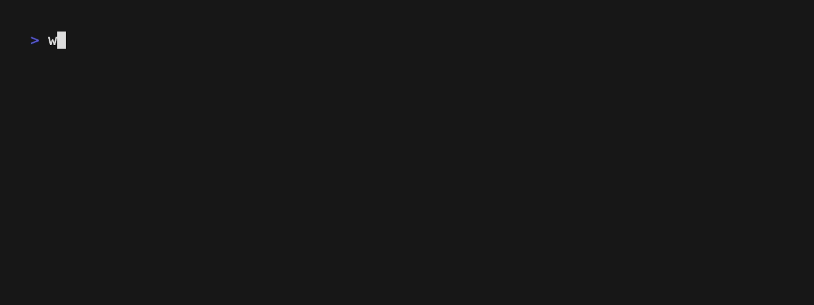

# Getting Started

The following walkthrough will help you get up and running with building and running your
first workflow template. By the end of this walkthrough, you will
have a solid foundation in the basics of iterative workflow template development.

!!! note
    Workflows developed in this way work across both Ecoscope Desktop and Ecoscope Web.
    However, custom workflows on Ecoscope Web are not yet supported for general contribution.
    The development process described here is uniform regardless of the target platform.

---

## Prerequisites

- First, [install `pixi`](https://pixi.prefix.dev/latest/installation/)
if you do not have it already.

- Then, install `wt-compiler`:

    ??? note "Note on `--run-post-link-scripts`"
        The `--run-post-link-scripts` flag is necessary because, in order to generate a visual
        representation of the workflow DAG, the `wt-compiler compile` command depends on the `dot` executable
        having been initialized post-install via the `dot -c` command. Setting the `--run-post-link-scripts`
        flag triggers this initialization automatically. Setting this flag does imply allowing the package
        manager to [run (potentially insecure) arbitrary scripts](https://pixi.prefix.dev/v0.62.2/reference/pixi_configuration/#run-post-link-scripts).
        If you prefer to omit this flag, then after you have installed `wt-compiler`, you may
        separately run `$HOME/.pixi/envs/wt-compiler/bin/dot -c` to initialize `dot`.

    ```console
    $ pixi global install \
    -c https://prefix.dev/ecoscope-workflows \
    -c conda-forge \
    wt-compiler \
    --run-post-link-scripts
    ```

- Third, install the Ecoscope Wizard Providers plugin for `wt-compiler`:

    ```console
    $ pixi global add \
        --environment wt-compiler \
        --git https://github.com/wildlife-dynamics/ecoscope.git \
        --tag wizard/v0.1.0 \
        --subdir wizard/ecoscope-wizard-providers
    ```

- Finally, [download and install the Ecoscope Desktop App](https://app.ecoscope.io/download) if you do not have it already.

---

## Step 1 — Scaffold a new workflow

In a clean directory on your machine, run:

```console
$ wt-compiler scaffold init
```



From the selection of Ecoscope wizard providers presented to you interactively, choose `ecoscope-events-map-example (ecoscope-wizard-providers)`.
Your workflow will be created under the file path you specified as the workflow id in the interactive wizard. So if you used the id `my_first_workflow`, then you would see:

```console
$ ls -a1 my_first_workflow
.
..
.gitattributes
.github
.gitignore
layout.json
LICENSE
README.md
spec.yaml
test-cases.yaml
```

## Step 2 — Compile the scaffold into a workflow template

From the new directory, compile:

```console
$ cd my_first_workflow
$ wt-compiler compile \
    --spec=spec.yaml \
    --pkg-name-prefix=ecoscope-workflows \
    --results-env-var=ECOSCOPE_WORKFLOWS_RESULTS \
    --install
```

You will now see a new folder in the template directory containing the compiled workflow:

```console
$ ls -a1 ecoscope-workflows-my-first-workflow-workflow
.
..
Dockerfile
.dockerignore
ecoscope_workflows_my_first_workflow_workflow
graph.png
.pixi
pixi.lock
pixi.toml
README.md
tests
VERSION.yaml
```

## Step 3 — Load the template into Ecoscope Desktop

Open Ecoscope Desktop and navigate to the **Templates** screen. You will see a list of any templates you have already imported, plus options to add new ones.


Click **Import Local Folder** and select the `my_first_workflow` folder (the root, not the compiled subdirectory). The template will be validated and added to the templates available to select in the Workflow Templates page.


## Step 4 — Configure and run a workflow

### Set up an EarthRanger data source

Before running the workflow, you need to configure a data source. Navigate to the **Data Sources** screen.


Click **Add Data Source** and select **EarthRanger**. Fill in the connection details for your EarthRanger site — you will need the site URL and your username and password for that site.

<div style="display: flex; gap: 1rem;" markdown="1">

  

  

</div>

### Configure the workflow

Return to the **Templates** screen, select your imported template, and click **New Workflow**. Ecoscope Desktop will present the configuration form — this form is generated from the parameters that are *not* bound under `partial` in your `spec.yaml`.


Select your EarthRanger data source, set a time range, and configure any other parameters that appear. The form fields, their types, and default values are all generated from the type annotations of the registered Python functions used to compose the workflow.


### Run the workflow

Once you are satisfied with the configuration, click **Submit**. You will be brought back to the My Workflows table, from where you can click **Run**. The workflow will then execute. Note that there is no streaming of progress — you will see a running spinner until the workflow completes.


### View the results

When the workflow completes, the status will be shown as **Success**, at which point you may click on the table row for that workflow to see the results dashboard. In this example you will see a single map widget showing event locations color-coded by event type.


## Step 5 — Change a parameter, recompile, and re-run

Now you will get your first taste of the iterative workflow development process.

Open `spec.yaml` in your editor and find the `events_colormap` task:

```yaml
- name: Events Colormap
  id: events_colormap
  task: apply_color_map
  partial:
    df: ${{ workflow.get_events_data.return }}
    input_column_name: event_type
    colormap: tab20b                    # ← change this
    output_column_name: event_type_colormap
```

Change the `colormap` value from `tab20b` to `Set3`:

```yaml
    colormap: Set3
```

Now recompile with the `--install` flag so the compiled package is updated in place:

```console
$ wt-compiler compile --spec=spec.yaml --pkg-name-prefix=ecoscope-workflows --results-env-var=ECOSCOPE_WORKFLOWS_RESULTS --install
```

Back on the Workflow Templates page in the app, via the kebab menu on the top right of the card for your workflow template, click **Delete**. Then re-import your workflow via the **Add Workflow Template** flow covered above, to pull in the updated workflow. Now, you may re-configure and re-run this workflow to see the changed result: the event markers now use the `Set3` color palette instead of `tab20b` as they did initially. This is the development loop in action: **edit → compile → run → observe → iterate**.

!!! note
    The Delete (vs. update-in-place) flow is a bit cumbersome. We plan to explore ways to smooth this out in a future release.

---

## Next steps

- **[Understanding spec.yaml](./understanding-spec.md)** — Walk through every line of the spec you just ran, and understand `partial`, `${{ }}` expressions, and `skipif`.
- **[Tutorials](./tutorials.md)** — Learn to write custom tasks, build widgets, configure groupers, and more.
- **[Examples](./examples.md)** — Study production-grade workflow repositories.
