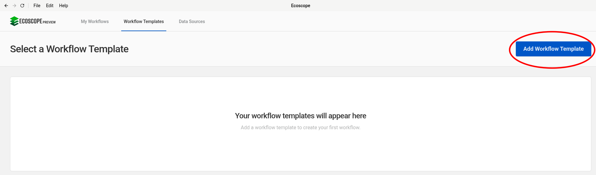
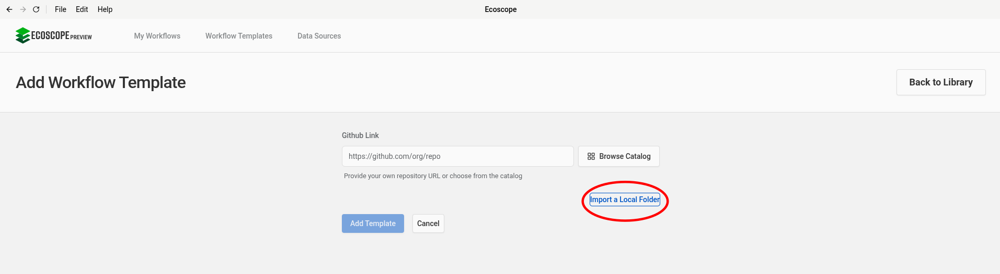
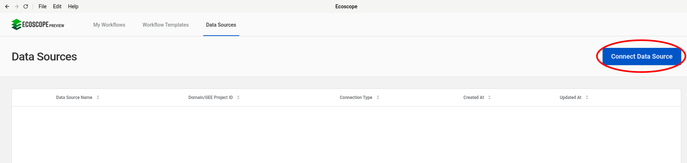
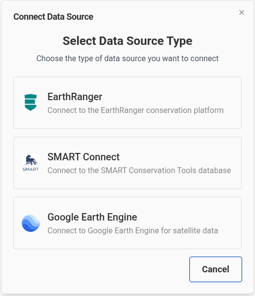
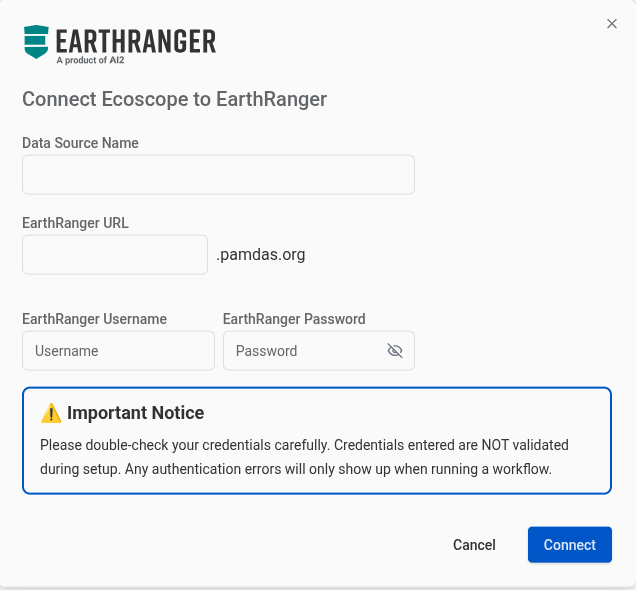
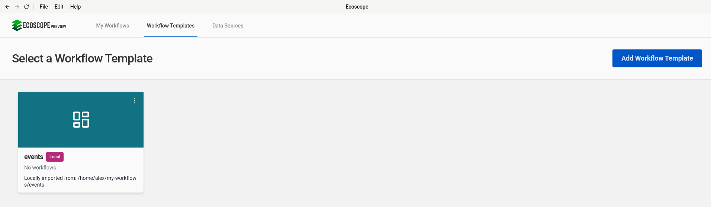
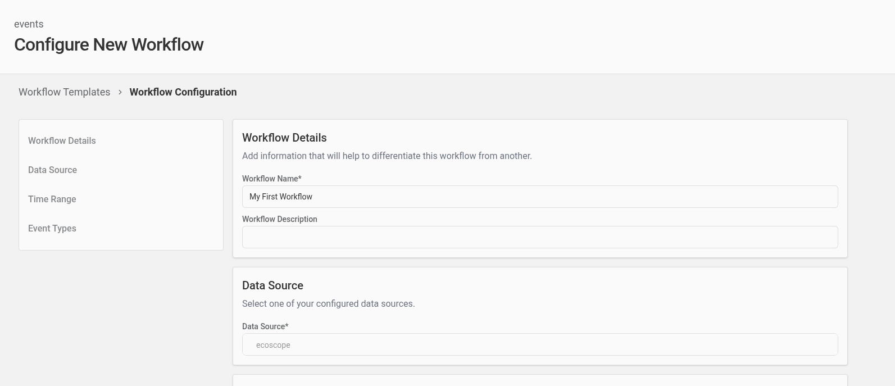
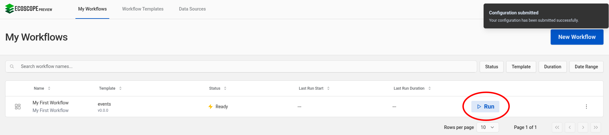
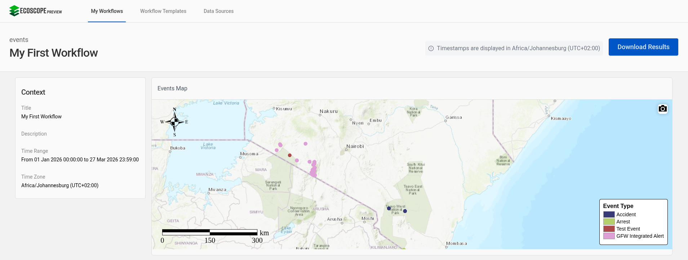

# Getting Started

The following walkthrough will help you get up and running with building and running your
first workflow template for the Ecoscope Desktop app. By the end of this walkthrough, you will
have a solid foundation in the basics of iterative workflow template development.

---

## Prerequisites

- First, [install `pixi`](https://pixi.prefix.dev/latest/installation/)
and [`uv`](https://docs.astral.sh/uv/getting-started/installation/#installing-uv)
if you do not have both already.

- Then, install `wt-compiler`:

    ??? note "Note on `--run-post-link-scripts`"
        The `--run-post-link-scripts` flag is necessary because, in order to generate a visual
        representation of the workflow DAG, the `wt-compiler compile` command depends on the `dot` executable
        having been initialized post-install via the `dot -c` command. Setting the `--run-post-link-scripts`
        flag triggers this initialization automatically. Setting this flag does imply allowing the package
        manager to [run (potentially insecure) arbitrary scripts](https://pixi.prefix.dev/v0.62.2/reference/pixi_configuration/#run-post-link-scripts).
        If you prefer to omit this flag, then after you have installed `wt-compiler`, you may
        separately run `$HOME/.pixi/envs/wt-compiler/bin/dot -c` to initialize `dot`.

    ```console
    $ pixi global install \
    -c https://prefix.dev/ecoscope-workflows \
    -c conda-forge \
    wt-compiler \
    --run-post-link-scripts
    ```

- Third, install the Ecoscope Wizard Providers plugin for `wt-compiler`:

    ```console
    $ pixi global add --environment wt-compiler ecoscope-wizard-providers
    ```

- Finally, [download and install the Ecoscope Desktop App](https://app.ecoscope.io/download) if you do not have it already.

---

## Step 1 — Scaffold a new workflow

In a clean directory on your machine, run:

```console
$ wt-compiler scaffold init
```

From the selection of Ecoscope wizard providers presented to you interactively, choose `events-map-example`.
Then, follow the remainder of the prompts until the wizard exits, and you will now see that the scaffold of
your workflow has been created:

```
~/events_map_example$ ls -la
total 40
drwxr-xr-x 3 user user 4096 Mar 27 15:00 .
drwxr-xr-x 3 user user 4096 Mar 27 15:00 ..
-rw-r--r-- 1 user user   40 Mar 27 15:00 .gitattributes
drwxr-xr-x 3 user user 4096 Mar 27 15:00 .github
-rw-r--r-- 1 user user  134 Mar 27 15:00 .gitignore
-rw-r--r-- 1 user user  109 Mar 27 15:00 layout.json
-rw-r--r-- 1 user user 1490 Mar 27 15:00 LICENSE
-rw-r--r-- 1 user user   71 Mar 27 15:00 README.md
-rw-r--r-- 1 user user 3286 Mar 27 15:00 spec.yaml
-rw-r--r-- 1 user user  597 Mar 27 15:00 test-cases.yaml
```

## Step 2 — Compile the scaffold into a workflow template

From the new directory, run:

```console
$ wt-compiler compile --spec=spec.yaml --pkg-name-prefix=ecoscope-workflows --results-env-var=ECOSCOPE_WORKFLOWS_RESULTS --install
```

You will now see a new folder in the template directory containing the compiled workflow:

```console
~/events_map_example$ ls -la ecoscope-workflows-events-example-workflow
total 1012
drwxr-xr-x 5 user user   4096 Mar 27 15:00 .
drwxr-xr-x 4 user user   4096 Mar 27 15:00 ..
-rw-r--r-- 1 user user    908 Mar 27 15:00 Dockerfile
-rw-r--r-- 1 user user    101 Mar 27 15:00 .dockerignore
drwxr-xr-x 3 user user   4096 Mar 27 15:00 ecoscope_workflows_events_example_workflow
-rw-r--r-- 1 user user 139006 Mar 27 15:00 graph.png
drwxr-xr-x 3 user user   4096 Mar 27 15:00 .pixi
-rw-r--r-- 1 user user 854027 Mar 27 15:00 pixi.lock
-rw-r--r-- 1 user user   3658 Mar 27 15:00 pixi.toml
-rw-r--r-- 1 user user    657 Mar 27 15:00 README.md
drwxr-xr-x 2 user user   4096 Mar 27 15:00 tests
-rw-r--r-- 1 user user     27 Mar 27 15:00 VERSION.yaml
```

## Step 3 — Load the template into Ecoscope Desktop

Open Ecoscope Desktop and navigate to the **Templates** screen. You will see a list of any templates you have already imported, plus options to add new ones.



Click **Import Local Folder** and select the compiled workflow directory (e.g. `ecoscope-workflows-events-example-workflow`). Desktop will validate the template and add it to your list.



## Step 4 — Create and run a workflow

### Set up an EarthRanger data source

Before running the workflow, you need to configure a data source. Navigate to the **Data Sources** screen.



Click **Add Data Source** and select **EarthRanger**. Fill in the connection details for your EarthRanger site — you will need the site URL and credentials.

<div style="display: flex; gap: 1rem;" markdown="1">

  

  

</div>

### Configure the workflow

Return to the **Templates** screen, select your imported template, and click **New Workflow**. Desktop will present the configuration form — this form is generated from the parameters that are *not* bound under `partial` in your `spec.yaml`.



Select your EarthRanger data source, set a time range, and configure any other parameters that appear. The form fields, their types, and default values all come from the task function signatures in the Platform SDK.



### Run the workflow

Once you are satisfied with the configuration, click **Run**. Desktop will execute each task in the DAG in order, streaming progress as it goes.



### View the results

When the workflow completes, Desktop displays the dashboard. In this example you will see a single map widget showing event locations color-coded by event type.




## Step 5 — Change a parameter, recompile, and re-run

Now you will get your first taste of the iterative workflow development process.

Open `spec.yaml` in your editor and find the `events_colormap` task:

```yaml
- name: Events Colormap
  id: events_colormap
  task: apply_color_map
  partial:
    df: ${{ workflow.get_events_data.return }}
    input_column_name: event_type
    colormap: tab20b                    # ← change this
    output_column_name: event_type_colormap
```

Change the `colormap` value from `tab20b` to `Set3`:

```yaml
    colormap: Set3
```

Now recompile with the `--install` flag so the compiled package is updated in place:

```console
$ wt-compiler compile --spec=spec.yaml --pkg-name-prefix=ecoscope-workflows --results-env-var=ECOSCOPE_WORKFLOWS_RESULTS --install
```

Back in Desktop, re-run the workflow. You will see the same map, but now the event markers use the `Set3` color palette instead of `tab20b`. This is the development loop in action: **edit → compile → run → observe → iterate**.

---

## Next steps

- **[Understanding spec.yaml](./understanding-spec.md)** — Walk through every line of the spec you just ran, and understand `partial`, `${{ }}` expressions, and `skipif`.
- **[Tutorials](./tutorials.md)** — Learn to write custom tasks, build widgets, configure groupers, and more.
- **[Examples](./examples.md)** — Study production-grade workflow repositories.
