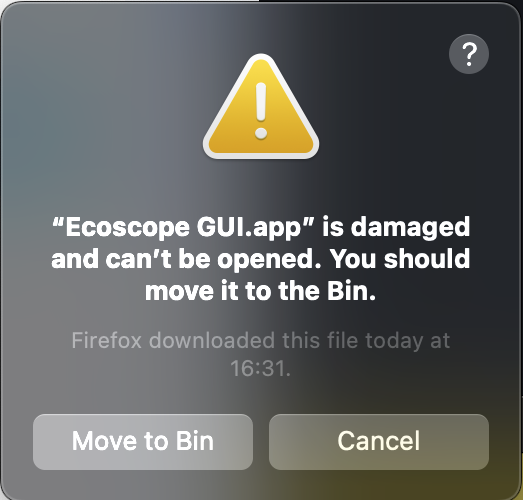
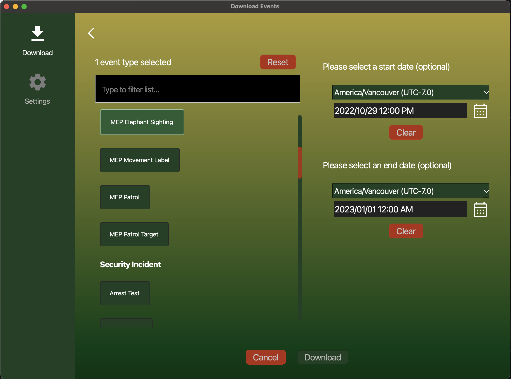
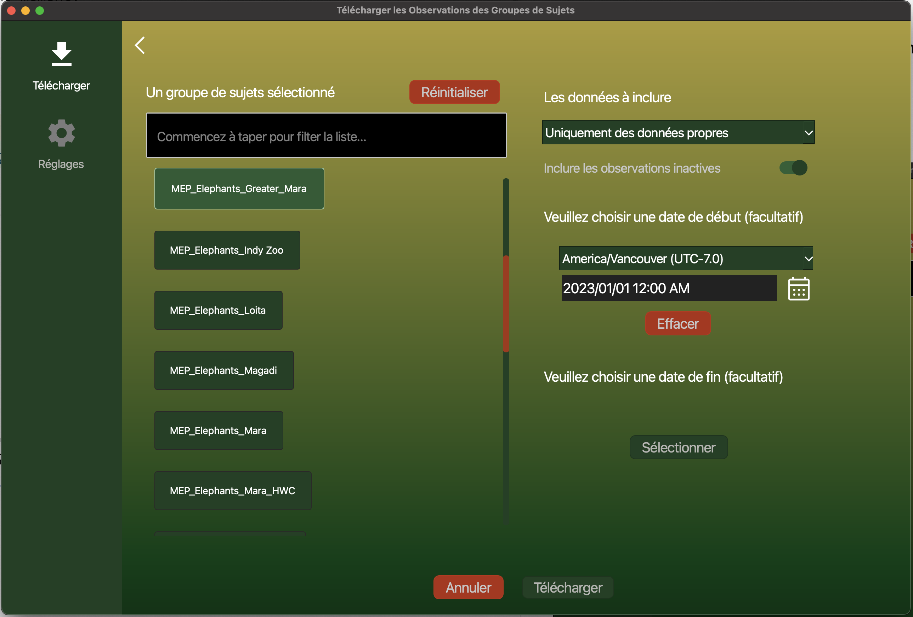
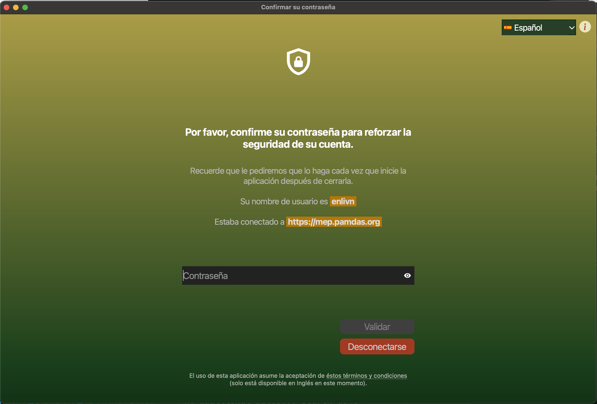

Ecoscope GUI
----

## Features

The Ecoscope GUI (graphical user interface) is an easy-to-use cross-platform software that allows you to:

- choose events or subject group observations from your EarthRanger instance, optionally filtered by date ranges
- download the data
- export the resulting data as either a geopackage (`.gpkg`) or a CSV (`.csv`) file and save it to your machine.

The GUI supports 3 user interface languages at the moment:

- 🇬🇧 English
- 🇫🇷 French
- 🇪🇸 Spanish

Screenshots can be found at [the bottom of the page](#Screenshots).

The GUI uses `ecoscope` under the hood to filter, clean, and process the downloaded data. The interface is built with
Python and the Qt graphical framework.

## Requirements

Please review the system requirements below that are needed to run the software before proceeding to
the [Downloads](#Downloads) section.

| OS      | CPU architecture       | Free Disk Space | Notes                                                         |
|---------|------------------------|-----------------|---------------------------------------------------------------|
| Windows | 64-bit                 | at least 1.5 GB | We've tested the software on Windows 11                       |
| MacOS   | Apple Silicon (64-bit) | at least 500 MB | We've tested the software on MacOS Monterey and MacOS Ventura |
| MacOS   | Intel (64-bit)         | at least 1.5 GB | We've tested the software on MacOS Monterey and MacOS Ventura |
| Linux   | 64-bit                 | at least 1.5 GB | We've tested the software on Ubuntu 22.04                     |

## Downloads

**We are actively working on open-sourcing the GUI code but until then downloads are hosted on the EarthRanger team's
Google Drive (links below).** Once the code has been open-sourced, releases will be provided via GitHub. More details
will
be provided on this page when that happens.

:::{note}
We do not collect any usage or other data about your use of the software. In addition, to ensure the safety of your
EarthRanger account, your login credentials are never saved to disk in plaintext. Instead, we will ask you to re-enter
your password
to confirm your identity every time you open the software.
:::

:::{tip}
For security-conscious users, as long as we host the files on Google Drive, we will provide the SHA-256 download
checksums below, so you can verify the integrity of the files you download.
:::

-----------

### Windows

:::{important}
Please make sure to review the instructions **before starting your download**.
:::

#### Instructions

1. Download the `.exe` file from the link below
2. Double-click on the downloaded `.exe` file
3. Follow the prompts until the installation succeeds
4. You will now have shortcuts on your Windows desktop and in the Windows start menu to start the program or to
   uninstall it

| Link                                                                          | Download Size (approximate) | Install Size (approximate) | SHA-256 checksum                                                   |
|-------------------------------------------------------------------------------|-----------------------------|----------------------------|--------------------------------------------------------------------|
| [Download](https://drive.google.com/file/d/1ONvvioykgeDivrQKxoovP88dBQ4EbRyP) | 200 MB                      | 930 MB                     | `fafc1b19e58cc25dbd98c5baaeec7e78fb54606e30a9b14c5a5d3768acb83891` |

-----------

### MacOS

:::{important}
Please make sure to review the instructions **before starting your download**.
:::

#### Instructions

1. Download the `.zip` file from the link below
2. Unzip the downloaded `.zip` file to get an `Ecoscope GUI.app` file
3. Open a command-prompt and type the following command:

```
xattr -dr com.apple.quarantine '/path/to/Ecoscope GUI.app'
```

For example, if you downloaded the file to your `Downloads` folder, you would write

```
xattr -dr com.apple.quarantine '/Users/your_macos_username/Downloads/Ecoscope GUI.app'
```

4. Double-click on the `Ecoscope GUI.app` file in Finder to run it.

| Link                                                                                              | Download Size (approximate) | Install Size (approximate) | SHA-256 checksum                                                   |
|---------------------------------------------------------------------------------------------------|-----------------------------|----------------------------|--------------------------------------------------------------------|
| (**Apple Silicon**) [Download](https://drive.google.com/file/d/1xFlUTQVbjlCsSiq-zHoqdP7pRV5mrlMg) | 170 MB                      | 470 MB                     | `2e5c254604f3c93e30320bc82f64b2e5a5fcca60b9be4942e2435398fbe3902c` |
| (**Intel**) [Download](https://drive.google.com/file/d/1RYuUf42ocs3GHwRYw3DD4SaPF9DIVAsG)         | 410 MB                      | 1.35 GB                    | `5cc7071c9cf6e28fb2ccbbf0f7e8c46327451bdffe68a94f185712cf89b8c60f` |

:::{attention}
Step 3 above is mandatory. If you skip it, you will not be able to open the program by
double-clicking `Ecoscope GUI.app`. Instead, you will see the following error dialog that
says `"Ecoscope GUI.app" is damaged and can't be opened.`

   ```{figure-md}
   {.bg-primary .mb-1 width=100px}

   '"Ecoscope GUI.app" is damaged and can't be opened' error.
   ```

If you see this error, do Step 3 and try double-clicking on `Ecoscope GUI.app` again. You do not need to re-download the
app.
:::

:::{note}
We're working on improving this so that you don't have to do step 3.
:::
-----------

### Linux

:::{important}
Please make sure to review the instructions **before starting your download**.
:::

#### Instructions

1. Download the `.zip` file from the link below.
2. Unzip the download `.zip` file to get an `Ecoscope GUI` directory.
3. Go into the `Ecoscope GUI` directory.
4. Double-click on the `Ecoscope GUI` binary executable.

| Link                                                                          | Download Size (approximate) | Install Size (approximate) | SHA-256 checksum                                                   |
|-------------------------------------------------------------------------------|-----------------------------|----------------------------|--------------------------------------------------------------------|
| [Download](https://drive.google.com/file/d/1jmBJKXLvCcg0gcXHV0siM_Hgsmjs1DWt) | 566 MB                      | 1.7 GB                     | `a23ad9d60523eb37f251059712c46613f277fb2e6d4be2d531cecc4abfdc6116` |

## Screenshots

:::{figure-md}
{.bg-primary .mb-1 width=200px}

Events download configuration screen (English)
:::

:::{figure-md}
{.bg-primary .mb-1 width=200px}

Subject group observations download configuration screen (French)
:::

:::{figure-md}
{.bg-primary .mb-1 width=200px}

Confirm your password on startup screen (Spanish)
:::
