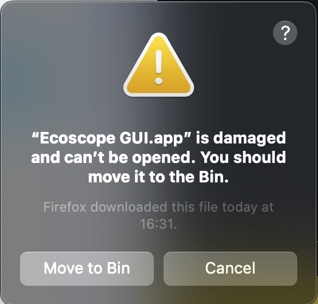
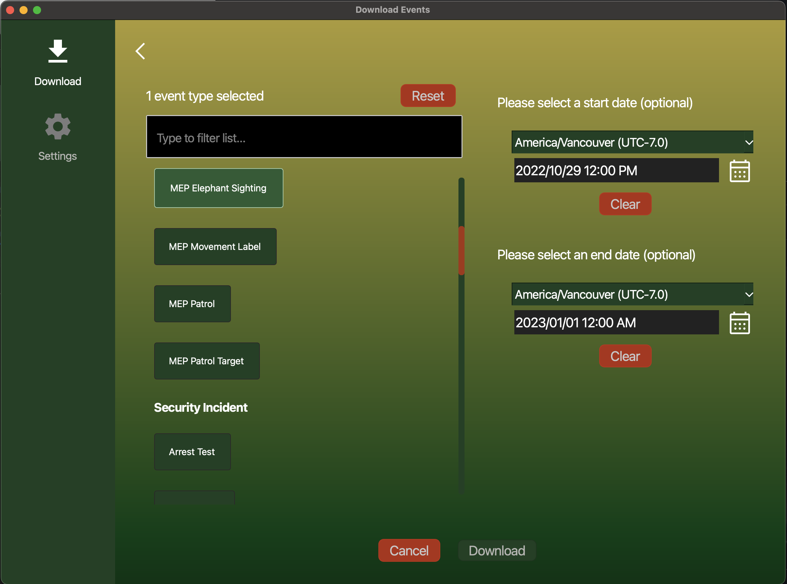
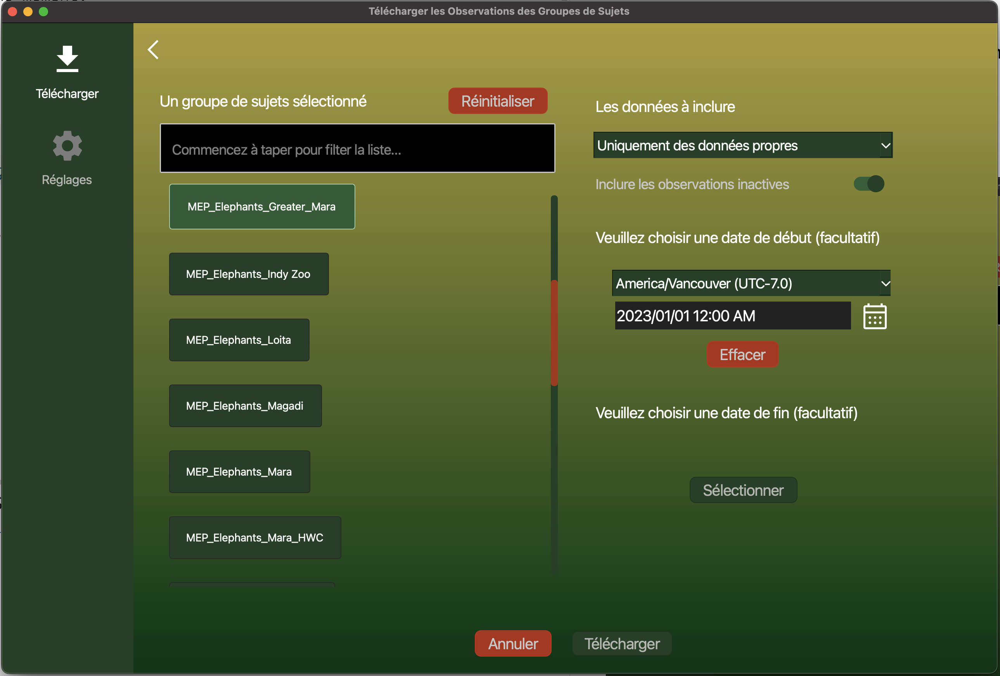
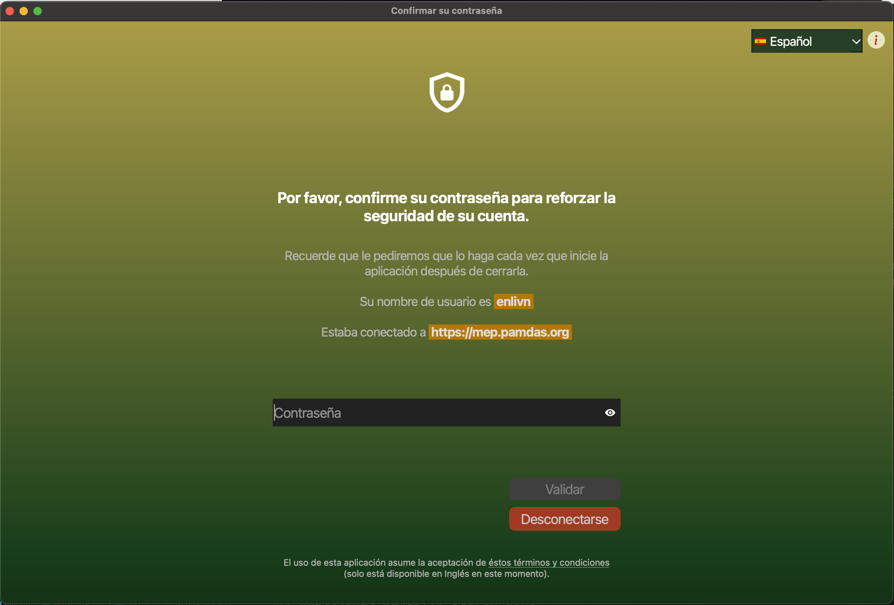

Ecoscope Downloader
----

:::{admonition} Sunset notice
:class: important

**Ecoscope Downloader will no longer be available to download after June 30, 2026.**

Ecoscope Downloader is being replaced by Ecoscope Desktop, a new application rebuilt from the ground up to be faster,
more reliable, and easier to improve. Windows, macOS, and Linux will continue to be supported.

After June 30, 2026, the Ecoscope Downloader links on this page will be replaced with links to download Ecoscope
Desktop. At that time, we recommend switching to Ecoscope Desktop.

**Why we are making this change**

Ecoscope Desktop will provide a more polished and user-friendly experience while preserving all existing Downloader
functionality for exporting your EarthRanger data. Ecoscope Desktop will also allow us to update workflow templates
separately from the application itself, so we can deliver workflow bug fixes and improvements to you more quickly. You
will also be able to run other Ecoscope workflows locally on your own computer, giving you more ways to analyze and work
with your data.

:::

## Features

Ecoscope Downloader is an easy-to-use cross-platform app that allows you to:

- choose events or subject group observations from your EarthRanger instance, optionally filtered by date ranges
- download the data
- export the resulting data as either a geopackage (`.gpkg`) or a CSV (`.csv`) file and save it to your machine.

The app supports 3 user interface languages at the moment:

- 🇬🇧 English
- 🇫🇷 French
- 🇪🇸 Spanish

Screenshots can be found at [the bottom of the page](#Screenshots).

Ecoscope Downloader uses `ecoscope` under the hood to filter, clean, and process the downloaded data. The interface is
built with Python and the Qt graphical framework.

## Requirements

Please review the system requirements below that are needed to run the software before proceeding to
the [Downloads](#Downloads) section.

| OS      | CPU architecture       | Free Disk Space | Notes                                                                                       |
|---------|------------------------|-----------------|---------------------------------------------------------------------------------------------|
| Windows | 64-bit                 | at least 1.5 GB | We've tested the software on Windows 11                                                     |
| MacOS   | Apple Silicon (64-bit) | at least 500 MB | We've tested the software on MacOS Monterey, MacOS Ventura, MacOS Sonoma, and MacOS Sequoia |
| MacOS   | Intel (64-bit)         | at least 1.5 GB | We've tested the software on MacOS Monterey, MacOS Ventura, MacOS Sonoma, and MacOS Sequoia |
| Linux   | 64-bit                 | at least 1.5 GB | We've tested the software on Ubuntu 22.04                                                   |

## Downloads

**We are actively working on open-sourcing the Ecoscope Downloader code, but until then downloads are hosted on the
EarthRanger team's Google Drive (links below).** Once the code has been open-sourced, releases will be provided via
GitHub. More details will be provided on this page when that happens.

:::{note}
We do not collect any usage or other data about your use of the software. In addition, to ensure the safety of your
EarthRanger account, your login credentials are never saved to disk in plaintext. Instead, we will ask you to re-enter
your password
to confirm your identity every time you open the software.
:::

:::{tip}
For security-conscious users, as long as we host the files on Google Drive, we will provide the SHA-256 download
checksums below, so you can verify the integrity of the files you download.
:::

-----------

### Windows

:::{important}
Please make sure to review the instructions **before starting your download**.
:::

#### Instructions

1. Download the `.exe` file from the link below
2. Right-click on the downloaded `.exe` file and choose `Run as Administrator`
3. Follow the prompts until the installation succeeds
4. You will now have shortcuts on your Windows desktop and in the Windows start menu to start the program or to
   uninstall it

| Link                                                                          | Download Size (approximate) | Install Size (approximate) | SHA-256 checksum                                                   |
|-------------------------------------------------------------------------------|-----------------------------|----------------------------|--------------------------------------------------------------------|
| [Download](https://drive.google.com/file/d/1oHPaDz-AWQ2mqfpirkDDCg9OJLYgXNFb) | 200 MB                      | 930 MB                     | `34007b6bfe8ea69752f50f7ac0be2b0a6eb1b569946f7f891a76a7bbace0258f` |

-----------

### MacOS

:::{important}
Please make sure to review the instructions **before starting your download**.
:::

#### Instructions

1. Download the `.zip` file from the link below
2. Unzip the downloaded `.zip` file to get an `Ecoscope Downloader.app` file
3. Open a command-prompt and type the following command:

```
xattr -dr com.apple.quarantine '/path/to/Ecoscope Downloader.app'
```

For example, if you downloaded the file to your `Downloads` folder, you would write

```
xattr -dr com.apple.quarantine '/Users/your_macos_username/Downloads/Ecoscope Downloader.app'
```

4. Double-click on the `Ecoscope Downloader.app` file in Finder to run it.

| Link                                                                                              | Download Size (approximate) | Install Size (approximate) | SHA-256 checksum                                                   |
|---------------------------------------------------------------------------------------------------|-----------------------------|----------------------------|--------------------------------------------------------------------|
| (**Apple Silicon**) [Download](https://drive.google.com/file/d/1ZIPmkHsc1ovFSgdJpFCyM7V-qxzi9SDq) | 170 MB                      | 470 MB                     | `c45ac1c3b120dbce56e9d93d20bd452d5b94b9b1a77dced403b308fd0322e4fd` |
| (**Intel**) [Download](https://drive.google.com/file/d/1A7LMo8vO7dJYoccNNPWB9aczCj6ciVri)         | 410 MB                      | 1.35 GB                    | `eb630bc010087a8c9ac3ef535326d1211a694b16b11bafe9af08b2660a3c674d` |

:::{attention}
Step 3 above is mandatory. If you skip it, you will not be able to open the program by
double-clicking `Ecoscope Downloader.app`. Instead, you will see the following error dialog that
says `"Ecoscope Downloader.app" is damaged and can't be opened.`

   ```{figure-md}
   {.bg-primary .mb-1 width=100px}

   '"Ecoscope Downloader.app" is damaged and can't be opened' error.
   ```

If you see this error, do Step 3 and try double-clicking on `Ecoscope Downloader.app` again. You do not need to
re-download the app.
:::

:::{note}
We're working on improving this so that you don't have to do step 3.
:::
-----------

### Linux

:::{important}
Please make sure to review the instructions **before starting your download**.
:::

#### Instructions

1. Download the `.zip` file from the link below.
2. Unzip the download `.zip` file to get an `Ecoscope Downloader` directory.
3. Go into the `Ecoscope Downloader` directory.
4. Double-click on the `Ecoscope Downloader` binary executable.

| Link                                                                          | Download Size (approximate) | Install Size (approximate) | SHA-256 checksum                                                   |
|-------------------------------------------------------------------------------|-----------------------------|----------------------------|--------------------------------------------------------------------|
| [Download](https://drive.google.com/file/d/1vVqTi8su0vInFlYuL5dFtz1QZxZjPwLQ) | 566 MB                      | 1.7 GB                     | `a13197070e07df14a3d04e4a62b2bf89998cbdb2520d37ae1014120ce6847459` |

## Screenshots

:::{figure-md}
{.bg-primary .mb-1 width=200px}

Events download configuration screen (English)
:::

:::{figure-md}
{.bg-primary .mb-1 width=200px}

Subject group observations download configuration screen (French)
:::

:::{figure-md}
{.bg-primary .mb-1 width=200px}

Confirm your password on startup screen (Spanish)
:::
